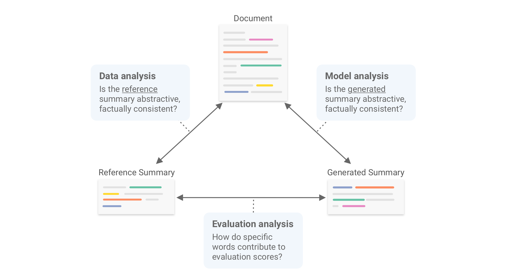

# SummVis

SummVis is an open-source visualization tool that supports fine-grained analysis of summarization models, data, and evaluation 
metrics. Through its lexical and semantic visualizations, SummVis enables in-depth exploration across important dimensions such as factual consistency and abstractiveness.
 
Authors: [Jesse Vig](https://twitter.com/jesse_vig)<sup>1</sup>, 
[Wojciech Kryściński](https://twitter.com/iam_wkr)<sup>1</sup>,
 [Karan Goel](https://twitter.com/krandiash)<sup>2</sup>,
  [Nazneen Fatema Rajani](https://twitter.com/nazneenrajani)<sup>1</sup><br/>
  <sup>1</sup>[Salesforce Research](https://einstein.ai/) <sup>2</sup>[Stanford Hazy Research](https://hazyresearch.stanford.edu/)

📖 [Paper](https://arxiv.org/abs/2104.07605)
🎥 [Demo](https://vimeo.com/540429745)

<p>
    
</p>

_We welcome issues for questions, suggestions, requests or bug reports._

## Table of Contents
- [User guide](#user-guide)
- [Installation](#installation)
- [Quickstart](#quickstart)
- [Load data into SummVis](#loading-data-into-summvis)
- [Deploying SummVis remotely](#deploying-summvis-remotely)
- [Citation](#citation)
- [Acknowledgements](#acknowledgements)

## User guide

### Overview
SummVis is a tool for analyzing abstractive summarization systems. It provides fine-grained insights on summarization
models, data, and evaluation metrics by visualizing the relationships between source documents, reference summaries,
and generated summaries, as illustrated in the figure below.<br/>

 

### Interface

The SummVis interface is shown below. The example displayed is the first record from the
 [CNN / Daily Mail](https://huggingface.co/datasets/cnn_dailymail) validation set. 

 


#### Components

**(a)** Configuration panel<br/>
**(b)** Source document (or reference summary, depending on configuration)<br/>
**(c)** Generated summaries (and/or reference summary, depending on configuration)<br/>
**(d)** Scroll bar with global view of annotations<br/>

#### Annotations   


**N-gram overlap:** Word sequences that overlap between the document on the left and
 the selected summary on the right. Underlines are color-coded by index of summary sentence. <br/>
**Semantic overlap**: Words in the summary that are semantically close to one or more words in document on the left.<br/>
**Novel words**: Words in the summary that do not appear in the document on the left.<br/>
**Novel entities**: Entity words in the summary that do not appear in the document on the left.<br/>

### Limitations   
Currently only English text is supported. Extremely long documents may render slowly in the tool.

## Installation
```shell
git clone https://github.com/robustness-gym/summvis.git
cd summvis
# Following line necessary to get pip > 21.3
pip install --upgrade pip
pip install -r requirements.txt
```

## Quickstart

View an example from [WikiNews](examples/wikinews/README.md):

```shell
streamlit run summvis.py -- --path examples/wikinews/wikinews.cache
```


## Loading data into SummVis

### If you have already generated summaries:

The following steps describe how to load source documents and associated precomputed summaries into the SummVis tool.

**1. Download spaCy model**
```
python -m spacy download en_core_web_lg
```
This may take several minutes.

**2. Create .jsonl file with the source document, reference summary and/or generated summaries in the following format:** 

```
{"document":  "This is the first source document", "summary:reference": "This is the reference summary", "summary:testmodel1": "This is the summary for testmodel1", "summary:testmodel2": "This is the summary for testmodel2"}
{"document":  "This is the second source document", "summary:reference": "This is the reference summary", "summary:testmodel1": "This is the summary for testmodel1", "summary:testmodel2": "This is the summary for testmodel2"}
```

The key for the reference summary must equal `summary:reference` and the key for any other summary must be of the form
`summary:<name>`, e.g. `summary:BART`. The document and at least one summary (reference, other, or both) are required.

We also provide [scripts to generate summaries](#if-you-do-not-have-generated-summaries) if you haven't done so already.

**3. Preprocess .jsonl file**

Run `preprocessing.py` to precompute all data required in the interface (running `spaCy`, lexical and semantic
 aligners) and save a cache file, which can be read directly into the tool. Note that this script may take some time to run
  (~5-15 seconds per example on a MacBook Pro for
 documents of typical length found in CNN/DailyMail or XSum), so you may want to start with a small subset of your dataset
using the `--n_samples` argument (below). This will also be expedited by running on a GPU.

```shell
python preprocessing.py \
--workflow \
--dataset_jsonl path/to/my_dataset.jsonl \
--processed_dataset_path path/to/my_cache_file
```

Additional options:   
    `--n_samples <number_of_samples>`: Process the first `number_of_samples` samples only (recommended).   
    `--no_clean`: Do not perform additional text cleaning that may remove newlines, etc.   

**4. Launch Streamlit app**

```shell
streamlit run summvis.py -- --path path/to/my_cache_file_or_parent_directory
```

Note that the additional `--` is not a mistake, and is required to pass command-line arguments in Streamlit.

### If you do NOT have generated summaries:

Before running the steps above, you may run the additional steps below to generate summaries. You may also refer to the [sample
end-to-end loading scripts](examples/)  for [WikiNews](examples/wikinews/load.sh) (loaded from .jsonl file) and [XSum](examples/xsum/load.sh)
(loaded from HuggingFace Datasets).

**1. Create file with the source documents and optional reference summaries in the following format:**

```
{"document":  "This is the first source document", "summary:reference": "This is the reference summary"}
{"document":  "This is the second source document", "summary:reference": "This is the reference summary"}
```

You may create a .jsonl format directly from a Huggingface dataset by running `preprocessing.py` with the `--standardize` flag:

```shell
python preprocessing.py \
--standardize \
--dataset hf_dataset_name \
--version hf_dataset_version (optional) \
--split hf_dataset_split \
--save_jsonl_path path/to/save_jsonl_file
```

**2. Generate predictions**

```shell
python generation.py --model model_name --data_path path/to/jsonl_file
```

This will generate a prediction file named `<model_name>.<dataset_file_name>.predictions`

**3. Join one or more prediction files (from previous step) with original dataset**

```shell
python join.py \
  --data_path path/to/jsonl_file \
  --generation_paths \
      path/to/prediction_file_1 \
      path/to/prediction_file_2 \
  --output_path path/to/save_jsonl_file
```

Once you complete these steps, you may proceed with the [final steps](#if-you-have-already-generated-summaries) to load your file into SummVis.

## Deploying SummVis remotely

See these tutorials on deploying a Streamlit app to various cloud services (from [Streamlit docs](https://docs.streamlit.io/en/stable/streamlit_faq.html)):

* [How to Deploy Streamlit to a Free Amazon EC2 instance](https://towardsdatascience.com/how-to-deploy-a-streamlit-app-using-an-amazon-free-ec2-instance-416a41f69dc3), by Rahul Agarwal   
* [Host Streamlit on Heroku](https://towardsdatascience.com/quickly-build-and-deploy-an-application-with-streamlit-988ca08c7e83), by Maarten Grootendorst   
* [Host Streamlit on Azure](https://towardsdatascience.com/deploying-a-streamlit-web-app-with-azure-app-service-1f09a2159743), by Richard Peterson   
* [Host Streamlit on 21YunBox](https://www.21yunbox.com/docs/#/deploy-streamlit), by Toby Lei 

## Citation

When referencing this repository, please cite [this paper](https://arxiv.org/abs/2104.07605):

```
@misc{vig2021summvis,
      title={SummVis: Interactive Visual Analysis of Models, Data, and Evaluation for Text Summarization}, 
      author={Jesse Vig and Wojciech Kry{\'s}ci{\'n}ski and Karan Goel and Nazneen Fatema Rajani},
      year={2021},
      eprint={2104.07605},
      archivePrefix={arXiv},
      primaryClass={cs.CL},
      url={https://arxiv.org/abs/2104.07605}
}
```

## Acknowledgements

We thank [Michael Correll](http://correll.io) for his valuable feedback.


